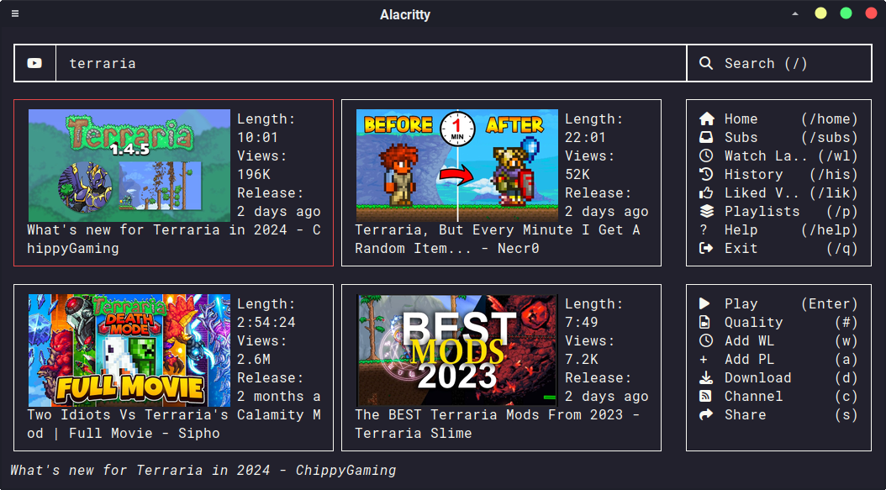
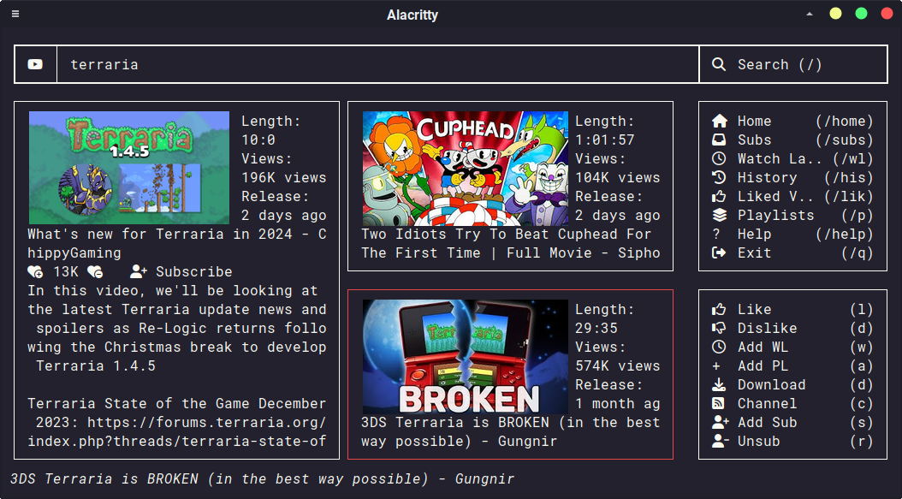
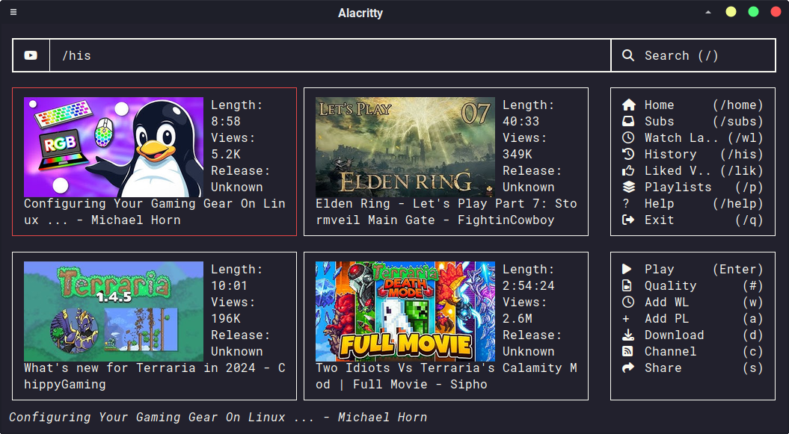

# GoTube

A YouTube client in the terminal with thumbnails. Allows displaying images in any terminal using ueberzug, and provides access to YouTube account features with no API keys needed.

### Screenshots

* Basic video search

* Video page with description and recommendations

* Video watch history (synced with account)

### Features

#### Video Finding

* Video Search
* Access to user history, subscriptions, watch later and saved playlists
* Recommendations (home page and video page)
* No API keys needed
* Video thumbnails, real images with Ueberzug

#### Video Playing

* Play videos with [mpv](https://github.com/mpv-player/mpv) - much faster loading than default
* Format options (current options: 480p, 720p, 1080p, 1440p, 2160p)
* Resume video from time in history
* Includes YouTube chapters in mpv

#### Video Management

* Add and remove videos from your playlists (including watch later)
* Saves watch time to history

## Version

* Currently in "Beta" state, features are present and working but may be buggy
* UI subject to change (i.e. some parts still look ugly and I think of a better idea)

## Installation

### Dependancies

* Firefox
* mpv
* ueberzug
* golang

### Install

`git clone URL`  
`cd gotube`  
`make`  
`make install`  

Log into YouTube in Firefox. Ensure there is a `~/.mozilla/firefox/[something].default-release/` directory. This should be the default save location for the cookies file when Firefox is insatlled using a package manager.

## Usage

### Command Line

`gotube -h/--help/help` - Display help  
`gotube` - Launch onto blank page, commands can be entered to find content  
`gotube -s/--subscriptions` - Launch and show subscriptions  
`gotube -hs/--history` - Launch and show history  
`gotube -wl/--watchlater` - Launch and show watch later  
`gotube -p/-l/--playlists/--library` - Launch and show library  
`gotube -hm/--recommendations/--home` - Launch and show home page  

### TUI

Once launched, the search box can be focused with `/` or `Tab`, and the grid can be focused with `Tab`. Navigation around the grid can be done with arrow keys or vim keys. PageUp/Down, Home and End also supported. `Ctrl-C`, `Esc` or `q` to quit. Other keyboard commands are show in the sidebar.  
Commands can be entered in the search box, beginning with a `/`. These are also shown in the sidebar.

## Planned Features

* Channel pages
* Chrome cookies support
* [VLC](https://www.videolan.org/) support
* More format options
* Audio only playback
* View/interact with comments
* Like/dislike videos
* Sub/unsub from channels
* Change order of videos in playlist
* CLI mode - use functionality in other scripts
* Video downloading TUI (frontend for yt-dlp)
* Video queue
